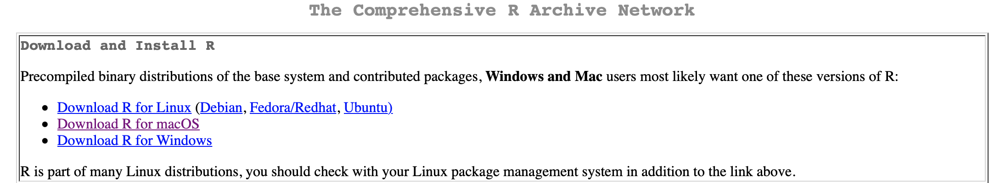

# Getting started with RStudio {#introrstudio}

## Installing R

For downloading R, just visit the website of the [Comprehensive R Archive Network (CRAN)](https://cran.r-project.org). CRAN is simply a network of ftp and web servers all around the world. Here, things related to R (code, documentation, etc.) are stored and can be downloaded. 
On top of the page, you will find a box with three links that refer to different versions depending on your operating system. Choose the one that applies. 

 

Thereafter, just click the link for downloading the latest version (we will work with R 4.1.0). If you are on a Mac (as I am), it will look like this: 

 

After the download is finished, just execute the installer and, once it is done, you can proceed with the installation of RStudio. 

New versions of R are released multiple times per year. If you want to update your R, the process is the same as installing it from scratch: go to [https://cran.r-project.org](https://cran.r-project.org), download the latest version, install it, and that is basically it.

## Installing RStudio

When you are on a Windows or Mac machine and you click the R icon, a window (the so-called Mac or Windows GUI -- graphic user interface) that looks pretty much like your machine's terminal will appear. You could now just type R code in there and execute it -- and, in fact, that is how the users did it the ancient way. In my opinion, this is fairly inconvenient. Luckily, we have progressed a lot from that and come up with IDEs (integrated development environments) for R. The most popular among them is RStudio which we will use as well.

To install RStudio, just click on [this link](https://rstudio.com/products/rstudio/download/), choose the right version (i.e., RStudio Desktop -- Open Source License), and hit the download button. After downloading it, you simply install it, and then you are good to go.

## Setting up RStudio

After installing RStudio, you can open it just like every other application on your machine. When you open it for the very first time, a window will appear that looks like this:


As you can see, there are three panes. When you open a script (for instance, by clicking File >> New File >> R Script), a fourth one will appear in the upper part on the left side. If you open multiple scripts, they will be organized in tabs as well^[more on scripts at the end of session 1.2.].  

Every pane contains different things:    

* By default, the console can be found in the lower left pane. This is basically how the GUI would look like. You can either manually enter commands, and execute them by pressing return, or write code in the script (upper left pane), and run it by either clicking "Run" or hitting cmd/ctrl+return (Mac/Windows). Then, the console will show, (1), the code you ran and, (2), depending on what you executed, the output.    
* In the upper right pane, there are two tabs: the environment and the history. The former will show you all the objects you have defined, the latter all the commands you have executed.  
* The lower left pane now consists of four tabs: "Files" simply shows you the files that are stored in the working direction you are in. "Plots" is only used if you have plotted something -- and is then called automatically, so you will probably never click on it. In "Packages", as the name hints on, all the packages that are installed are listed. In theory, you could call them from there as well -- but I strongly recommend not to. And finally, the "Help" tab provides you with documentations of packages etc. This sounds handy, but I hardly use it -- simple googling or calling the `?[name_of_function]` has worked out best for me so far.

In the following, I will tell you more about what has appeared to work best *FOR ME*:

**Disclaimer: Every useR has their own preferences when it comes to their setup. Hence, you should see the following paragraphs only as recommendations that originate from my experience.**

As you may have noticed, there are a lot of different things RStudio provides you with. However, in every-day use, you will mostly use these five: the script you are actually working on. The console for seeing what your code has produced. The environment for a quick overview of the objects you are actually working with. The "Files" section for seeing the files in your working directory (this is where R projects will come in extremely handy). The "Plots" section for seeing your visualizations.  
As the latter opens by itself as soon as you plot something, I mainly use the former four. However, if you use RStudio projects -- as you definitely should -- you will only occasionally need the "Files" section. Furthermore, your screen is wider than it is high. Hence, vertical space is scarcer than horizontal. At the heart of your coding lies your script, you should therefore give it the utmost space possible. On the right then there is space for two panes you will always have to give quick glimpses: the console and the environment. I put the former to the bottom and the latter on top. When the "Plots" section opens up, you will manually have to return to your former tab. Therefore, I put it to the lower left side where it does not bother me and I can minimize it with one click when I do not need it anymore.

My RStudio layout looks like this: 


How you accomplish this? `Preferences >> Pane Layout`.

Other strongly recommended settings (ordered by Options section):

* `General`: Never save your work space, this makes you lazy (read more [here](https://rstats.wtf/save-source.html))
* `Code`: some "Display" settings make your life easier; also set default encoding to UTF-8 in the "Save" section  
* `Appearance`: check out some themes (I use: RStudio theme "Modern", Editor font "Courier", Font size 11, and Editor theme "Cobalt") 
* `Panes layout`: feel free to set them up the way I did

More inspiration can be found [here](https://drdoane.com/my-rstudio-configuration/).

## Some remarks on your daily workflow

As some of you are beginners, it might be hard for you to see the point in setting up projects and a GitHub account already. The intermediate and advanced users among you, who are not familiar with projects and GitHub yet though, might also wonder what they would need it for: working with R has gone pretty well in the past, so why should you change this running system?  

I start out making points on why using Projects is useful. Then, I will provide step-by-step guidance on how to set them up. Since using GitHub is not that straight-forward, I will motivate why to use it and then link to a bigger tutorial covering the setup process (again by Jennifer Bryan, a statistic professor who also works at RStudio).

### RStudio Projects

#### Motivation

Disclaimer: those things might not be entirely clear right away. However, I am deeply convinced that it is important that you use R and RStudio properly from the start. Otherwise it won't be as easy to re-build the right habits.

If you analyze data with R, one of the first things you do is to load in the data that you want to perform your analyses on. Then, you perform your analyses on them, and save the results in the (probably) same directory.  
When you load a data set into R, you might use the `readr` package and do `read_csv(absolute_file_path.csv)`. This becomes fairly painful if you need to read in more than one data set. Then, relative paths (i.e., where you start from a certain point in your file structure, e.g., your file folder) become more useful. 
How you CAN go across this is to use the `setwd(absolute_file_path_to_your_directory)` function. Here, `set` stands for set and `wd` stands for working directory. If you are not sure about what the current working directory actually is, you can use `getwd()` which is the equivalent to `setwd(file_path)`. This enables you to read in a data set -- if the file is in the working directory -- by only using `read_csv(file_name.csv)`.  
However, if you have ever worked on an R project with other people in a group and exchanged scripts regularly, you may have encountered one of the big problems with this `setwd(file_path)` approach: as it only takes absolute paths like this one: "/Users/felixlennert/Library/Mobile Documents/com~apple~CloudDocs/phd/teaching/hhs-stockholm/fall2021/scripts/", no other person will be able to run this script without making any changes^[This becomes especially painful if you teach R to your students and have to grade 20 submissions and, hence, have to paste your personal directory's file path into each of these submissions.]. Just to be clear: there are no two machines which have the exact same file structure.  

This is where RStudio Projects come into play: they make every file path relative. The Project file (ends with .Rproj) basically sets the working directory to the folder it is in. Hence, if you want to send your work to a peer or a teacher, just send a folder which also contains the .Rproj file and they will be able to work on your project without the hassle of pasting file paths into `setwd()` commands.

#### How to create an RStudio Project?

I strongly suggest that you set up a project which is dedicated to this course.

1. In RStudio, click File >> New Project… 
2. A windows pops up which lets you select between "New Directory", "Existing Directory", and "Version Control." The first option creates a new folder which is named after your project, the second one "associates a project with an existing working directory," and the third one only applies to version control (like, for instance, GitHub) users. I suggest that you click "New Directory".
3. Now you need to specify the type of the project (Empty project, R package, or Shiny Web Application). In our case, you will need a "new project." Hit it!  
4. The final step is to choose the folder the project will live in. If you have already created a folder which is dedicated to this course, choose this one, and let the project live in there as a sub-directory.
5. When you write code for our course in the future, you *first* open the R project -- by double-clicking the .Rproj file -- and then create either a new script or open a former one (e.g., by going through the "Files" tab in the respective pane which will show the right directory already.)

## R scripts and RMarkdown

In this course, you will work with two sorts of documents to store your code in: R scripts (suffix `.R`) and RMarkdown documents (suffix `.Rmd`). In the following, I will briefly introduce you to both of them.

### R scripts

The console, where you can only execute your code, is great for experimenting with R. If you want to store it -- e.g., for sharing -- you need something different. This is where R scripts come in handy. When you are in RStudio, you create a new script by either clicking `File >> New File >> R Script` or ctrl/cmd+shift+n. There are multiple ways to run code in the script:   
* cmd/ctrl+return (Mac/Windows) -- execute entire expression and jump to next line   
* option/alt+return (Mac/Windows) -- execute entire expression and remain in line   
* cmd/ctrl+shift+return (Mac/Windows) -- execute entire script from the beginning to the end (rule: every script you hand in or send to somebody else should run smoothly from the beginning to the end)   

If you want to make annotations to your code (which you should do because it makes everything easier to read and understand), just insert '#' into your code. Every expression that stands to the right of the '#' sign will not be executed when you run the code. 

### RMarkdown

A time will come where you will not just do analyses for yourself in R, but you will also have to communicate them. Let's take a master's thesis as an example: you need a type of document that is able to encapsulate: text (properly formatted), visualizations (tables, graphs, maybe images), and references. An RMarkdown document can do it all, plus, your entire analysis can live in there as well. So there is no need anymore for the cumbersome process of copying data from MS Excel or IBM SPSS into an MS Word table. You just tell RMarkdown what it should communicate and what not. (Note that all the project work for this course has to be handed in using R Markdown files.) In the following, I will not provide you with an exhaustive introduction to RMarkdown. Instead, I will focus on getting you started and then referring you to better, more exhaustive resources. It is not that I am too lazy to write a big tutorial, but there are state-of-the-art tutorials and resources (which mainly come straight from people who work on the forefront of the development of these tools) which are available for free. By linking to them, I want to encourage you to get involved and dig into this stuff. So, let's get you started!

You create an RMarkdown file by clicking `File >> New File >> R Markdown`…. Then, a window pops up that looks like this:


Note that you could also do a presentation (with the `beamer` package), a `shiny` app, or use templates. We will focus on simple RMarkdown documents^[but feel free to approach me if you want to get some additional resources on the other types.].
Here, you can type in a title, the name(s) of the author(s), and choose the default output format. For now you have to choose one, but later you can switch to one of the others whenever you want to.   
* *HTML* is handy for lightweight, quickly knitted files, or if you want to publish it on a website.   
* *PDF* is good if you are experienced with $\LaTeX$ and want to further modify it in terms of formatting etc., or simply want to get a more formally looking document (I use it if I need to hand in something that is supposed to be graded). If you want to knit to PDF, you need a running $\LaTeX$ version on your machine. If you do not have one, I recommend you to install `tinytex.` I linked installation instructions down below.
* *Word* puts out an MS Word document -- especially handy if you collaborate with people who are either not experienced in R, like older faculty, or want some parts to be proof-read (remember the Track-Changes function?). Note that you need to have MS Word installed on your machine.   

Did you notice the term "knit"? The logic behind RMarkdown documents is that you edit them in RStudio and then "knit" them. This means that it calls the `knitr` package. Thereby, all the code you include into the document is executed from scratch. If the code does not work and throws an error, the document will not knit -- hence, it needs to be properly written to avoid head-scratching. The `knitr` package creates a markdown file (suffix: .md). This is then processed by `pandoc`, a universal document converter. The big advantage of this two-step approach is that it enables a wide range of output formats.

For your first RMarkdown document, choose HTML and click "OK". Then, you see a new plain-text file which looks like this: 


In the top section, surrounded by `---`, you can see the so-called YAML header (or YAML metadata, or YAML frontmatter -- check out [Wikipedia](https://en.wikipedia.org/wiki/YAML) for more information on it). YAML stands for "YAML Ain't Markup Language" and it is a human-readable data-serialization language. Quick heads-up: indentation matters in your YAML header. This is the metadata of your document. In this minimalistic example, the title, the author, the date, and the desired output are specified (as you specified them when you created the new document). Hence, you can always change them. 

After the YAML header, there comes a code chunk. Code chunks start with ` ```{r} ` and end with ` ``` `. Inside the code chunk, you can write R code which can be executed by either clicking the green "Play" button or by using the same keyboard shortcuts as in scripts. There are several chunk options available: either click on the sprocket or check them out online and include them in the chunk's header (like this: ` ```{r include=FALSE} `). 
Beyond that, you can (and should) name your chunks. This makes it easier to find the flawed ones when your document fails to knit. This is done by simply including the name into the title like this: ` ```{r cars} `. Find more on chunk options [here](https://bookdown.org/yihui/rmarkdown/r-code.html).

The double hashes imply that "R Markdown" is a header. In the text, there are examples on how to include links ("<>"), how to make text bold (double asterixes), etc. For more information on how to format plain text in an RMarkdown document, check out the RMarkdown [cheatsheet](https://rstudio.com/wp-content/uploads/2016/03/rmarkdown-cheatsheet-2.0.pdf?_ga=2.261726157.1753636382.1588487988-401398042.1588487988) and [Reference guide](https://rstudio.com/wp-content/uploads/2015/03/rmarkdown-reference.pdf?_ga=2.261726157.1753636382.1588487988-401398042.1588487988).

## Further links

* If you require a more extensive description of how to install R and RStudio, click here: [Hands-on Programming with R -- Appendix A](https://rstudio-education.github.io/hopr/starting.html), a book by one of the co-authors of R for Data Science.
* If you are already more advanced, you can read more useful stuff on using R and RStudio by two RStudio employees: [What they forgot to teach you about R](https://rstats.wtf/index.html)
* Hadley Wickham and Garrett Grolemund wrote an [entire chapter](https://r4ds.had.co.nz/workflow-scripts.html) in R4DS on scripts -- and on [RMarkdown](https://r4ds.had.co.nz/r-markdown.html).   
* Yihui Xie, J. J. Allaire, and Garrett Grolemund wrote what they call "R Markdown: The Definitive Guide". It is freely available [online](https://bookdown.org/yihui/rmarkdown/).   
* An introduction to RMarkdown from RStudio can be found [here](https://rmarkdown.rstudio.com/lesson-1.html).   
* Yihui Xie published a [manual](https://yihui.org/tinytex/) for installing the `tinytex` package.   
* If you want to write academic papers using RMarkdown, you need to be able to include references properly. When I decided to do so, I found it sort of complicated. However, I stuck to [this tutorial](https://ikashnitsky.github.io/2019/zotero/) and since then it has worked like a charm. More on this in Session #8.
* [GitHub](www.github.com) might make your daily life and your shared projects decisively easier, especially in connection with RMarkdown. Find an illustration of its potential in [this vide](https://www.youtube.com/watch?v=s3JldKoA0zw).
